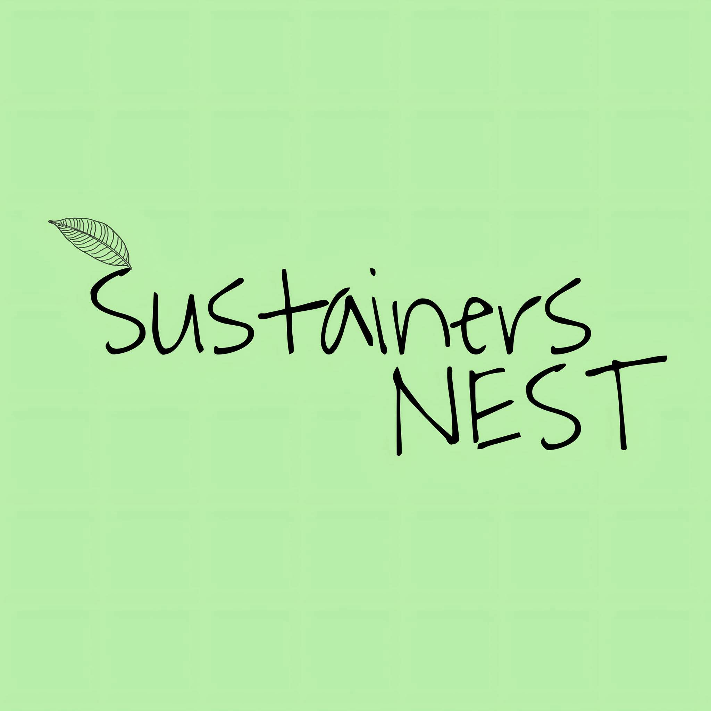

# Sustainers NEST



**Sustainers NEST (Nature, Environment, Science & Technology)** is a youth-driven organization dedicated to empowering the next generation of sustainability leaders. This repository contains the source code for the official multi-page organization website.

## 🌟 Overview

The Sustainers NEST website is a statically generated, responsive web application inspired by top environmental organizations. It features a modern "nature-tech" design system, interactive UI elements, and a clean, accessible layout designed to highlight the organization's impact.

### Core Pages
- **Home (`index.html`)**: Hero section, impact statistics, core pillars, and featured programs.
- **About (`about.html`)**: The organization's story, mission & vision, interactive timeline, and team.
- **Programs (`programs.html`)**: Detailed cards for all initiatives across Nature, Science, and Technology.
- **Events (`events.html`)**: Upcoming workshops, past symposiums, and latest announcements.
- **Get Involved (`get-involved.html`)**: Volunteer pathways, member journeys, and FAQs.
- **Contact (`contact.html`)**: Contact forms, interactive touchpoints, and social links.

## 🛠️ Tech Stack & Features
- **Frontend**: Vanilla HTML5, CSS3, JavaScript (No heavy frameworks, ensuring blazing fast load times).
- **Design System**: Custom CSS variables, CSS Grid/Flexbox, dynamic dark mode integrated.
- **Interactivity**: Custom scroll-reveal animations, counter animations, responsive mobile navigation, and interactive FAQ accordions.
- **Hosting Configuration**: Configured for Vercel with clean URL routing (`vercel.json`).

## 🚀 Local Development

To run this project locally, you don't need any complex build tools. You can use any local web server.

1. Clone the repository:
   ```bash
   git clone https://github.com/KawserMahamudJunyed/sustainers-nest.git
   cd sustainers-nest
   ```

2. Start a local server. If you have Node.js installed, you can use `npx`:
   ```bash
   npx serve .
   ```
   Or using Python:
   ```bash
   python -m http.server 3000
   ```

3. Open `http://localhost:3000` in your browser.

## 🌐 Deployment (Vercel)

This project is pre-configured for seamless deployment to [Vercel](https://vercel.com/).

1. Install the Vercel CLI:
   ```bash
   npm i -g vercel
   ```
2. Deploy the project from the root directory:
   ```bash
   vercel
   ```
3. *(Optional)* To push to production:
   ```bash
   vercel --prod
   ```

The `vercel.json` file handles dropping the `.html` extensions automatically for clean URLs (e.g., `/about` instead of `/about.html`).

## 📄 License
This project is licensed under the MIT License - see the [LICENSE](LICENSE) file for details.
